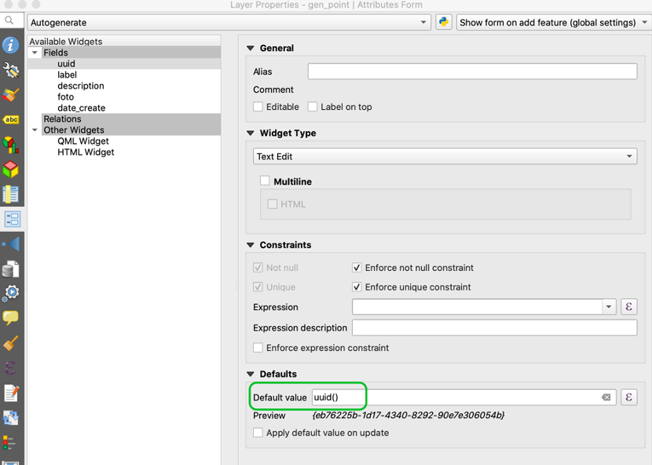
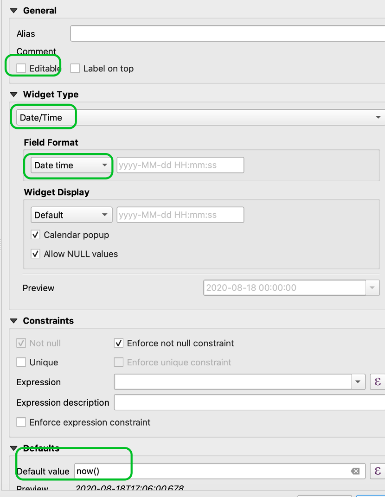
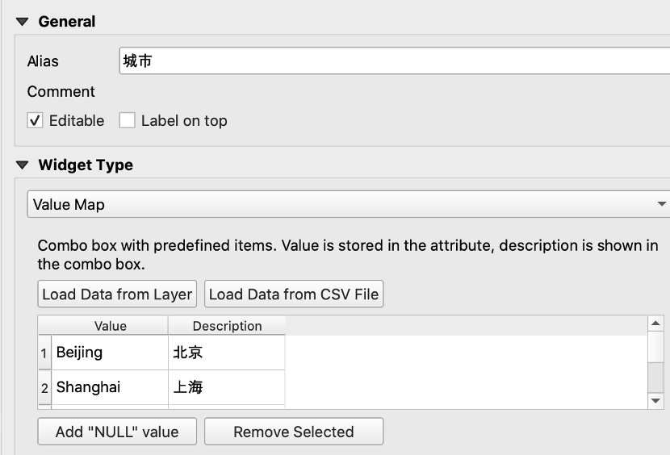
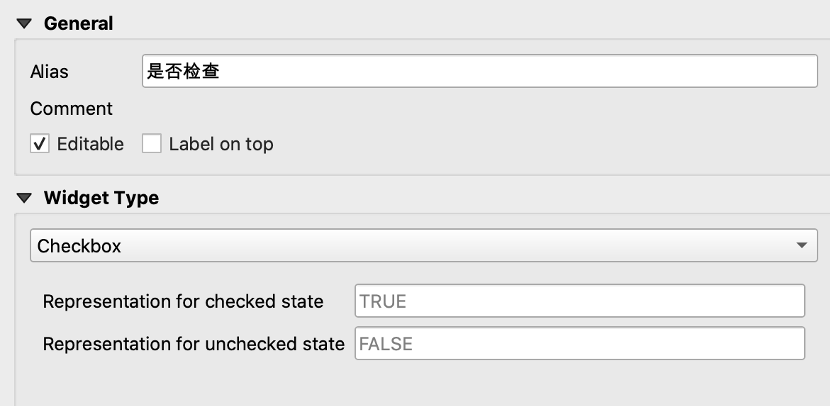
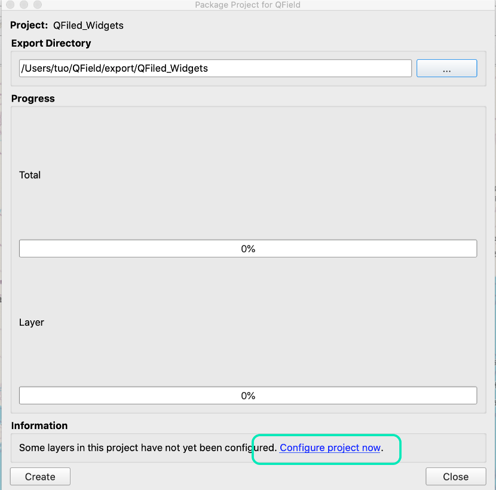
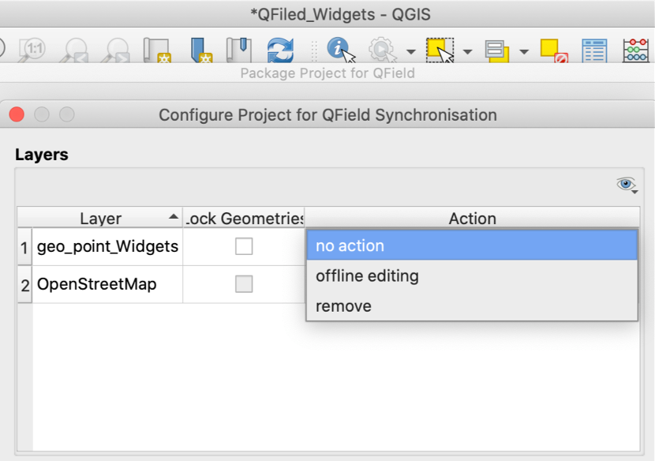

[QField](https://qfield.org/)是QGIS的Android的版本，另一个类似的版本叫[Input](https://inputapp.io/en/)，它可以在Android和IOS平台下运行。  
本文只讨论QField。  
步骤：  
### 1、通过QGIS创建工程，保存为.qgs的工程文件 
工程属性中保存选择相对目录  
 
#### 文件格式 
SHP文件  
按常规方法创建Shapefile文件即可   
PostGIS数据  
建立数据链接时要保存用户名和密码，否则在QField中会打开失败，因为QField中无法弹出输入用户名和密码的窗口。  
其他网络数据或底图  
直接将数据图层拖到QGIS的Layer控件中即可。  
栅格数据  
官方文档推荐使用geopackge，并有操作手册，但无奈我能力有限，无法完成，最后使用了QGIS的插件Tiles将栅格数据转换为MBTiles格式的文件，直接将文件拖到Layer控件即可。  
#### 字段设置 
   
UUID设置  
设置为字符串形式，默认值设置为 uuid()函数  
     
时间字段设置    
不可编辑，当前时间  
    
照片字段设置  
   
   
Dropdown List 字段    
城市字段，在Postgresql中设置为 varchar(255),在QGIS设置为value  
     
CheckBox字段  
   
### 2、数据导出
安装QFieldSync插件，将工程通过Package for QField将QGIS创建的工程导出为满足QField打开的文件。  
点击Package for QField菜单弹出的对话框中选择每一个图层的操作，包括 Copy（shape 或本地存储的栅格数据）、no action、offline editing和remove，如果是数据库在线编辑，选no action，离线编辑选offline editing，如果不希望QField中包含该图层，则选择remove。设置完毕后点击Create按钮创建导出的文件夹。  
     
     
### 3、数据同步
将导出的文件夹复制到装有QField的手机中,打开QField采集数据。如果数据是在线的Postgresql数据库数据，采集的数据自动进入数据库；如果数据是离线的数据，在文件夹中会有geopackage的数据文件，将手机中的对应文件夹拷贝到电脑，通过QFieldSync插件的Synchronize from QField功能进行数据同步；如果是shp文件，直接拷贝即可。

##### 引用  
[1 切片视频](https://www.youtube.com/watch?v=G_d8BN2pHLE&t=1s)  
[2 QField Quickstart](https://www.youtube.com/watch?v=kCh5jcg5cyI&t=835s)  
[3 QTiles replacement for QGIS3](https://gis.stackexchange.com/questions/353274/qtiles-replacement-for-qgis3)   
[4 栅格数据](https://qfield.org/docs/fr/data-formats/index.html#use-geopackage)   
[5 Dropdown list](https://gis.stackexchange.com/questions/322047/creating-a-dropdown-widget-in-qgis-for-qfield-project)