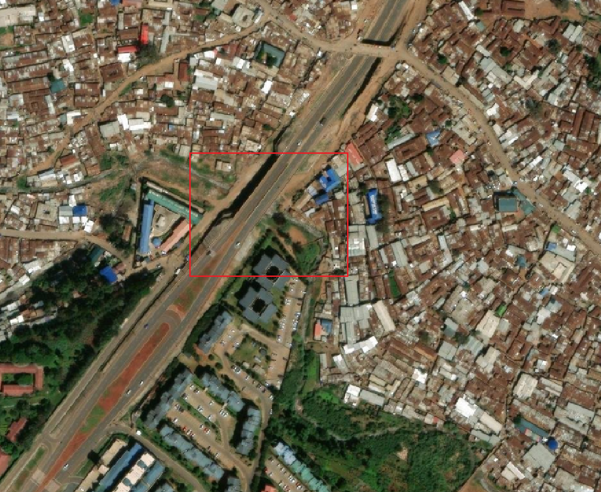
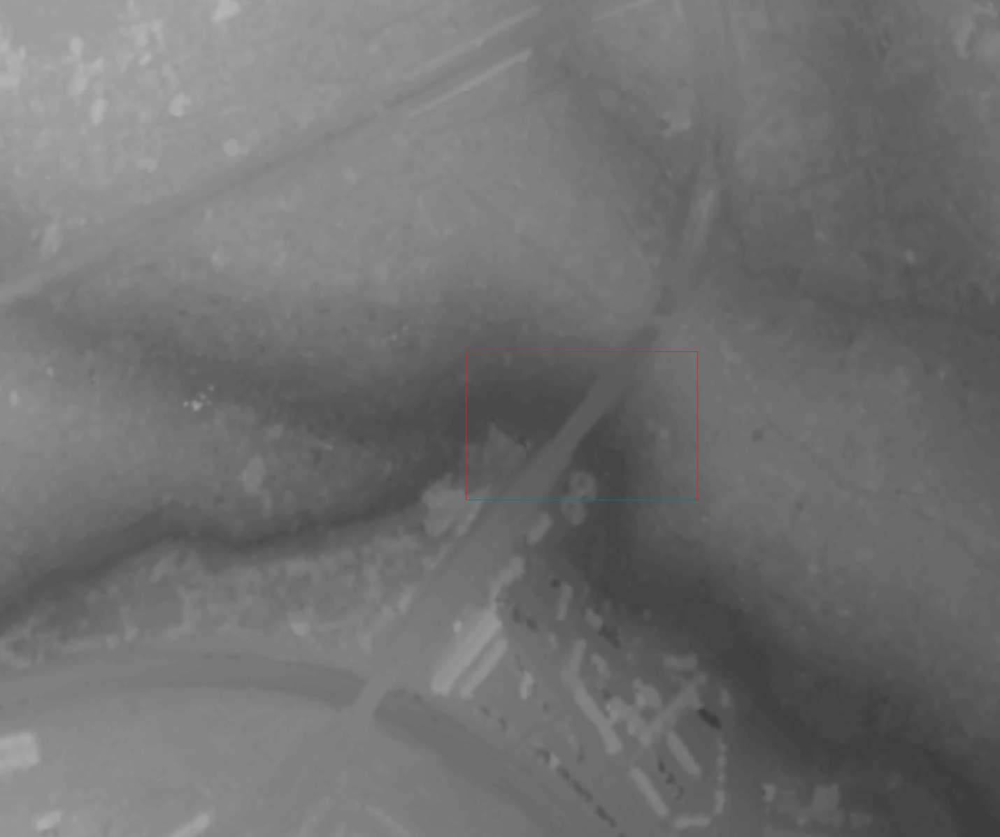
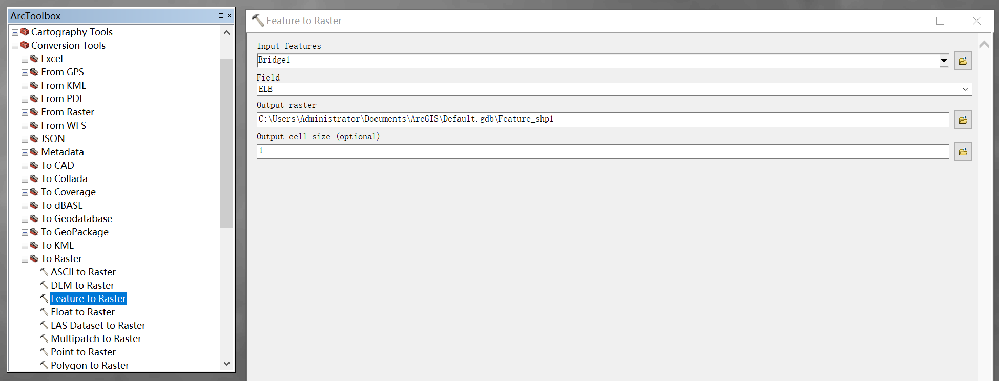
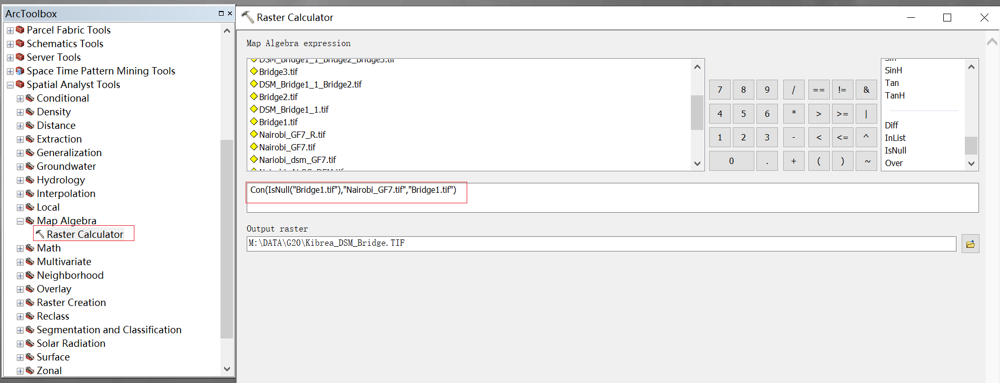
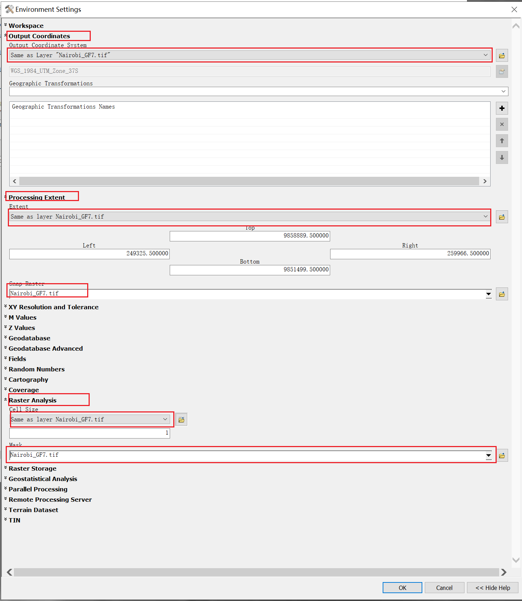

### 问题

使用GF7反演的DSM用于二维水动力模型计算时，大桥处的高程值高于周边，阻水。需要将桥的DSM与周边两侧的DEM齐平   
影像：  
  
DSM：  

  

### 解决方法
画一个多边形，将需要填充的高程值写入多边形属性，然后多边形转栅格，用[DEM数据局部更新思路](https://www.spatial.pro/2024/03/19/DEM%E6%95%B0%E6%8D%AE%E5%B1%80%E9%83%A8%E6%9B%B4%E6%96%B0%E6%80%9D%E8%B7%AF/)中的方法替换DEM。

### 步骤
#### 1 创建修改范围多边形  
使用ArcMap创建要修改高程区域的多边形，增加属性ELE，赋值1671.5  
  

#### 2 使用转换工具将矢量转为栅格

#### 3 使用地图计算器工具合并两个栅格数据

  
环境参数设置： 

#### 4结果

### 引用  
[arcgis 修改DEM部分小数据](https://blog.csdn.net/ggs0709ssg/article/details/121925148) 
[DEM数据局部更新思路](https://www.spatial.pro/2024/03/19/DEM%E6%95%B0%E6%8D%AE%E5%B1%80%E9%83%A8%E6%9B%B4%E6%96%B0%E6%80%9D%E8%B7%AF/)
